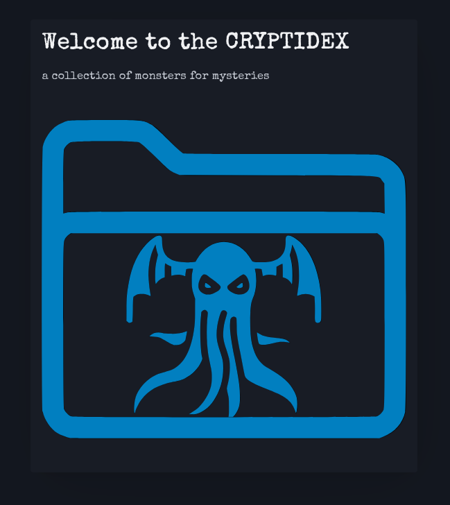

# Cryptidex

## Deployed Link

[Cryptidex](https://cryptidex-ca0adcd2989f.herokuapp.com/)

## Description

Cryptidex is a database app for collecting monster ideas for the tabletop roleplaying game Monster of the Week. Users can add a monsters, add powers and attacks to the monster. They can edit the monster details, and edit the powers and attacks indivdually. The user can also delete the monster as well as delete powers and attacks indivdually. The user can browse all of the monsters made my other users, check the monsters made by other users. The user can also save monsters made by other users.

## Attributions

- [PicoCSS](https://picocss.com/)
- [Monster of the Week](https://evilhat.com/product/monster-of-the-week/)
- [Google Material Design Icons](https://fonts.google.com/icons)
- [Google Font: Special Elite](https://fonts.google.com/specimen/Special+Elite)

## Technologies

- MongoDB
- Express
- Node.js
- Ejs
- JS
- CSS
- PicoCSS

## Next Steps

- Add an info page to explain terms
- Add the ability to add images to the monsters
- Add the ability to favorite, edit, and delete
- Add a user profile
- Add search and filtering option
- Add a type index
